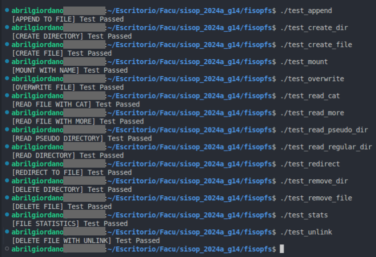

# fisop-fs
Presentamos a continuación la documentacion de diseño del filesystem implementado.

**A tener en cuenta**: *en todas las pruebas, tanto los tests en si mismos como las pruebas manuales que realizamos ya sea relacionadas a las operaciones o a la serializacion/deserializacion, fueron ejecutadas con el flag -f. Ejecutándolo en este modo debug, funciona todo correctamente, pero no logramos hayar el por qué no funciona como debería cuando se corre sin dicho flag.*

## Estructuras en Memoria
### Diagrama Resumen


### Estructura fs_t
El sistema de archivos se representa mediante una estructura principal llamada fs_t, que contiene un arreglo de bloques (blocks). Cada bloque es de tipo block_t, y representa ya sea un archivo o un directorio en el sistema de archivos. La cantidad máxima de bloques está definida por la constante MAX_BLOCKS, fijada en 100. Esta estructura se define de la siguiente manera:
```python
typedef struct fs {
    block_t blocks[MAX_BLOCKS];
} fs_t;
```
### Estructura block_t
Cada bloque en el sistema de archivos se representa con la estructura block_t. Esta estructura contiene los siguientes campos:

- int free: Indica si el bloque está libre (0) o en uso (1).
- type_t type: Indica el tipo de bloque, que puede ser un archivo (FS_FILE) o un directorio (FS_DIR).
- size_t size: Indica el tamaño de los datos almacenados en el bloque.
- stats_t stats: Almacena los metadatos del bloque, como el UID, GID, tiempo de último acceso y tiempo de última modificación.
- char data[MAX_DATA_SIZE]: Un arreglo de caracteres que contiene los datos del bloque.
- char path[MAX_PATH]: La ruta del archivo o directorio representado por el bloque.
- char dir_path[MAX_PATH]: La ruta del directorio que contiene al bloque.

```python
typedef struct block {
    int free;
    type_t type;
    size_t size;
    stats_t stats;
    char data[MAX_DATA_SIZE];
    char path[MAX_PATH];
    char dir_path[MAX_PATH];
} block_t;
```

### Estructura stats_t
La estructura stats_t almacena los metadatos de un bloque. Incluye los siguientes campos:

- uid_t uid: El ID de usuario.
- gid_t gid: El ID de grupo.
- time_t last_access: El tiempo del último acceso.
- time_t last_modification: El tiempo de la última modificación.

```python
typedef struct stats {
    uid_t uid;
    gid_t gid;
    time_t last_access;
    time_t last_modification;
} stats_t;
```

### Enumeración type_t
La enumeración type_t define los tipos posibles para un bloque: archivo o directorio.

```python
typedef enum type {
    FS_FILE,
    FS_DIR
} type_t;
```

## Búsqueda de Archivos por Ruta
Para encontrar un archivo específico dado un path, el sistema de archivos utiliza la función find_block. Esta función busca en el arreglo de bloques de la estructura fs_t el bloque que coincide con la ruta dada. La función realiza lo siguiente:

- Extrae la ruta del directorio padre y el nombre del archivo o directorio desde el path completo usando get_parent_path y get_path.
- Itera sobre todos los bloques en el sistema de archivos.
- Compara la ruta del bloque y la ruta del directorio padre con las obtenidas en el paso 1.
- Devuelve el bloque encontrado si hay una coincidencia, o NULL si no existe ningún bloque con la ruta especificada.

## Estructuras/Funciones Auxiliares
### Función strduplicate
Esta función se utiliza para duplicar cadenas de caracteres y se usa frecuentemente en el código para evitar manipulaciones directas de las cadenas de entrada.

```python
char *strduplicate(const char *src) {
    char *dst = malloc(strlen(src) + 1);
    if (dst == NULL) return NULL;
    strcpy(dst, src);
    return dst;
}
```

### Funciones get_path y get_parent_path
Estas funciones se utilizan para descomponer una ruta completa en el nombre del archivo o directorio y la ruta del directorio padre, respectivamente.

- get_path: Obtiene el nombre del archivo o directorio desde una ruta completa.
- get_parent_path: Obtiene la ruta del directorio padre desde una ruta completa.

## Formato de Serialización
La serialización del sistema de archivos se realiza mediante las funciones serialize y deserialize. Estas funciones permiten almacenar y recuperar el estado del sistema de archivos en un archivo binario en disco.

- **serialize**: Escribe el estado actual de la estructura fs_t en un archivo binario. Se asegura de abrir el archivo en modo binario y escribe toda la estructura en una operación de escritura.

```python
int serialize(const char *f, struct fs *filesystem) {
    FILE *file = fopen(f, "wb+");
    if (file == NULL) {
        perror("Error opening file");
        return -1;
    }
    if (fwrite(filesystem, sizeof(struct fs), 1, file) != 1) {
        perror("Error writing filesystem");
        fclose(file);
        return -1;
    }
    fclose(file);
    return 0;
}
```

- **deserialize**: Lee el estado del sistema de archivos desde un archivo binario y lo carga en la estructura fs_t. Se asegura de abrir el archivo en modo binario y lee toda la estructura en una operación de lectura.

```python
int deserialize(const char *f, struct fs *filesystem) {
    FILE *file = fopen(f, "rb");
    if (file == NULL) {
        perror("Error opening file");
        return -1;
    }
    if (fread(filesystem, sizeof(struct fs), 1, file) != 1) {
        perror("Error reading filesystem");
        fclose(file);
        return -1;
    }
    fclose(file);
    return 0;
}
```

## Decisiones Relevantes
- **Almacenamiento en Memoria**: El sistema de archivos está diseñado para operar completamente en memoria RAM, lo que permite un acceso rápido pero no garantiza la persistencia a largo plazo. Los datos se almacenan en un archivo en disco para persistir entre ejecuciones, pero no está diseñado para manejar grandes volúmenes de datos.

- **Límite de Bloques**: La cantidad máxima de bloques (MAX_BLOCKS) está limitada a 100, lo que restringe el tamaño del sistema de archivos pero simplifica la gestión y búsqueda de bloques.

- **Tamaño de Datos**: El tamaño máximo de los datos almacenados en un bloque (MAX_DATA_SIZE) está limitado a 1024 bytes, lo que significa que los archivos grandes deben ser divididos en múltiples bloques o no pueden ser almacenados en este sistema de archivos.

- **Rutas**: El tamaño máximo de las rutas de archivos/directorios (MAX_PATH) está limitado a 100 caracteres, lo cual simplifica la estructura y gestión de los mismos.

- **Códigos de Error Utilizados**: El filesystem implementado maneja diversos códigos de error para comunicar estados y problemas específicos durante la ejecución de las operaciones. A continuación, se detallan los principales códigos de error utilizados.
    1. *EEXIST* (File exists): Indica que el archivo o directorio que se intenta crear ya existe.

    2. *ENOSPC* (No space left on device): Indica que no hay suficiente espacio disponible para almacenar el nuevo archivo o directorio.

    3. *ENOENT* (No such file or directory): Indica que el archivo o directorio solicitado no se encontró en el sistema de archivos.

    4. *EFBIG* (File too large): Indica que el tamaño del archivo excede el límite máximo permitido (en nuestra implementación, MAX_DATA_SIZE).

    5. *EISDIR* (Is a directory): Indica que se esperaba un archivo pero se encontró un directorio.

    6. *ENOTDIR* (Not a directory): Indica que se esperaba un directorio pero se encontró un archivo.

    7. *ENOTEMPTY* (Directory not empty): Indica que se intentó eliminar un directorio que no está vacío.

    8. *EINVAL* (Invalid argument): Indica que se proporcionó un argumento inválido a la función.

## Testing
En conjunto con el filesystem, implementamos una serie de tests cuyo objetivo era verificar las diversas funcionalidades provistas. Demostramos a continuación las salidas satisfactorias de dichos tests, los cuales se encuentran disponibles en el directorio /tests.

