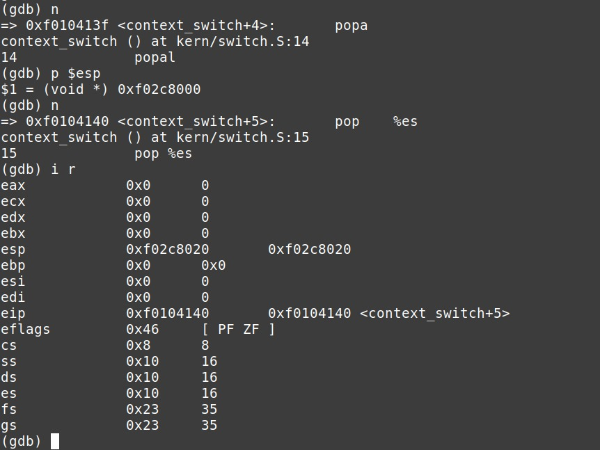

# sched

## Context Switch
Vemos a continuacion como se produce el context-switch, con imagenes que respaldan dicho cambio de contexto.

## Scheduler basado en Prioridades

Como scheduler basado en prioridades, decidimos implementar un planificador simil *Lottery*. La idea general se centra en repartir entre los procesos una cantidad de tickets segun su valor de prioridad. Luego, se realiza un sorteo y aquel proceso con el ticket ganador será el que se ejecuta. La idea es que cada vez que un proceso se ejecute, se disminuya su prioridad de manera de que se realice un correcto reparto de la CPU. Por otro lado, cada cierto tiempo se realiza un boost de prioridades para evitar el Starvation.

### Distribución de Tickets
La distribución de tickets es un paso crucial en el scheduler por prioridades, ya que determina la probabilidad de que un proceso sea seleccionado para ejecutarse en la siguiente iteración del ciclo de planificación.

Este código itera sobre todos los procesos en el sistema operativo y asigna tickets a cada proceso basándose en su prioridad. La cantidad de tickets asignados a un proceso es igual a su prioridad más uno. Luego, se calcula el total de tickets para todos los procesos y se ajusta la cantidad de tickets para cada proceso para que represente una fracción proporcional del total de tickets disponible (MAX_TICKETS).

### Seleccion del Proceso Ganador
Una vez que se han distribuido los tickets entre todos los procesos, el Scheduler por Prioridades selecciona el proceso ganador que se ejecutará en el CPU en la próxima iteración.

Para ello, se genera un número aleatorio entre 0 y MAX_TICKETS - 1. Luego, se itera sobre todos los procesos y se acumulan los tickets de cada proceso. Cuando la suma acumulada de tickets supera o iguala el número aleatorio generado, se selecciona el proceso correspondiente como el ganador y se devuelve su puntero. Esto asegura que los procesos con más tickets tengan una mayor probabilidad de ser seleccionados, lo que refleja su prioridad relativa con respecto al resto.

### Ejecución de un Proceso
Una vez seleccionado el proceso ganador, este debe ser ejecutado. Sin embargo, antes de la llamada a env_run, la prioridad del proceso se disminuye en 1. Esto garantiza que la próxima vez que este proceso esté en condiciones de ejecutarse, tendrá una probabilidad menor de ser seleccionado en comparación con otros procesos. Este mecanismo es crucial para prevenir la monopolización del CPU por un único proceso, asegurando que, dado que este proceso ya ha recibido tiempo de CPU, tenga menos chances de ejecutarse nuevamente en el corto plazo.

De no existir ningun proceso ganador como consecuencia de que no quedaron procesos en estado RUNNABLE, podra volverse a ejecutar el proceso que se encuentra corriendo actualmente.

### Boosting
El boosting de prioridades es un mecanismo utilizado para evitar la inanición de procesos de baja prioridad, asegurando que todos los procesos tengan la oportunidad de ejecutarse en intervalos regulares.

La funcion de boost_priorities se llama cada vez que el contador de ticks (ticks_since_last_boost) alcanza el valor definido por PRIORITY_BOOST_INTERVAL. En esta se recorren todos los procesos en estado ENV_RUNNABLE o ENV_RUNNING y sus prioridades se ajustan al valor máximo (10 en este caso). Esto asegura que todos los procesos recuperen una prioridad alta periódicamente, mitigando el riesgo de inanición.

### EJEMPLO: Uso intensivo de CPU
En la siguiente imagen, podemos ver que hay dos procesos CPU intensive, el que posee ID 4096 y 4107. A pesar de que hagan un uso intensivo de la CPU, vemos que los mismos van avanzando en su ejecucion, en parte tambien gracias al Boost implementado.

### EJEMPLO: Syscall para disminuir la prioridad
En este nuevo caso, probamos un programa de usuario el cual hace uso de las syscalls para modificar las prioridades. En particular, podemos ver como la prioridad de dicho proceso pasa a 0 abruptamente, y luego gracias al Boost, sube nuevamente.

